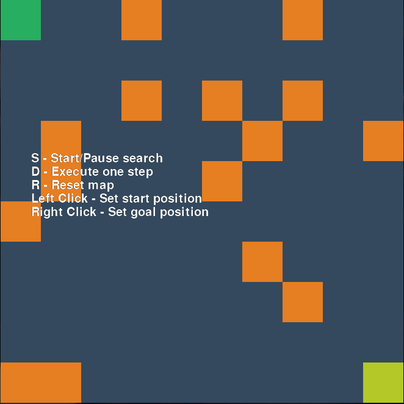
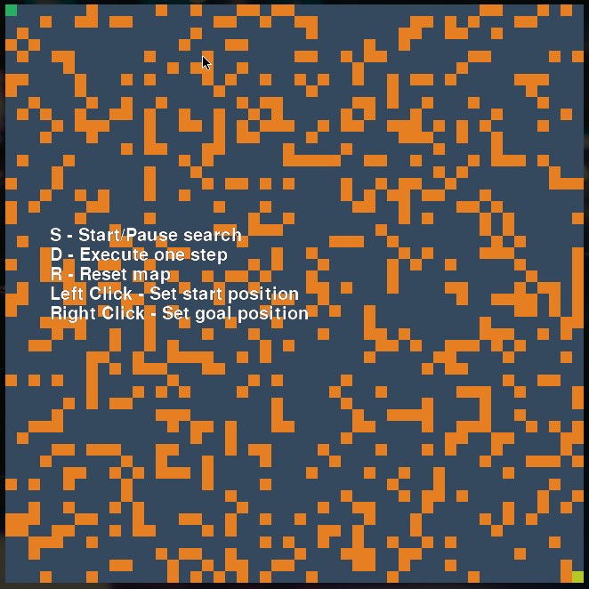

# A* with PyGame (and docs!)

This was originally implemented as a homework for an intro to AI a while ago (over 3 years!). Figured it was time to put it in GitHub so I can look back at it in the future :).

To run:
```
    python a-star.py <square-map-size> <percentage-of-obstacles (0~1)>
```

Doxygen generated docs can be accessed at index.html.

You can click around the map, and change the start and goal positions.



